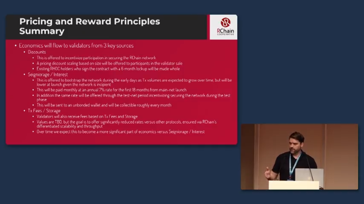

# Staking and Validation

In [Become a validator and acquire RHOC for staking](https://www.rchain.coop/blog/become-a-validator-and-acquire-rhoc-for-staking/), Kenny Rowe explains the mechanics, economics, and the process of becoming a validator.

Or watch his [staking presentation][krtalk] from RCon3, Sep 2018.

[][krtalk]

[krtalk]: https://www.youtube.com/watch?v=VeSkk_pBdNs&index=15&list=PLf2bbiic5ZjCQPNxJhW9qdplBaizVISFf
