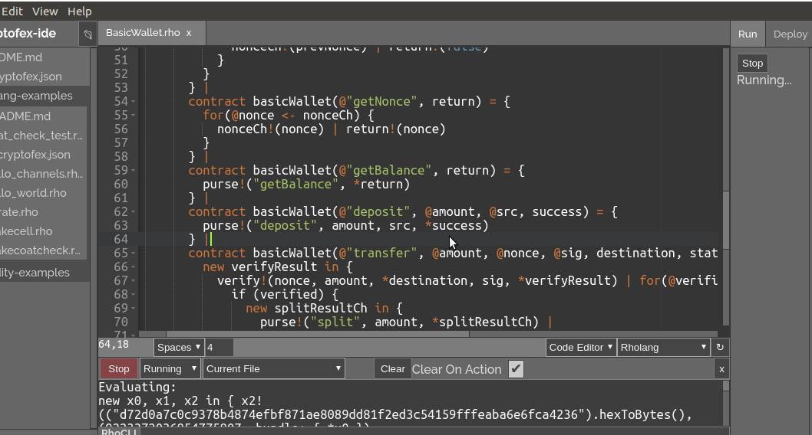

# Build dApps with Rholang

::: tip Office Hours and Tutorials

Try the [Learn Rholang](https://www.rchain.coop/learn-rholang) tutorial.

Join guided peer learning in **Rholang office hours**
([calendar][cal]) and stay tuned to the [Tutorial][tut] blog category
for items like [Start Coding in Rholang Roday][aug6].

[tut]: https://www.rchain.coop/blog/category/developer/tutorial/
[cal]: https://calendar.google.com/calendar/embed?src=2cj152c9nidh6glpr1d5g4eq28%40group.calendar.google.com&ctz=America%2FChicago
[aug6]: https://www.rchain.coop/blog/start_coding_in_rholang/

:::

Rholang is RChain's social contract language, built on the [rho
calculus](research.md#rho-calculus) foundation.

## Features

  - Fine grain concurrency
  - Spatial pattern matching
  - Tuple-space persistence
  - Reflection
  - Cryptographic hashing and signature validation
  - Capability security through encapsulation

Increasingly, the RChain platform itself is written in Rholang:

<figure class="screenshot">

<figcaption> <a href=
"https://github.com/rchain/rchain/blob/dev/casper/src/main/rholang/BasicWallet.rho"
>BasicWallet.rho</a> contract in the <a href="https://cryptofex.io/"
>Cryptofex</a> IDE</figcaption>
</figure>

## Development Tools

In addition to the basic `repl`, `eval`, and `deploy` features of
[rnode](rnode.md), try:

* [Cryptofex IDE](https://cryptofex.io/)
* [RChain.cloud](https://rchain.cloud/) - try Rholang in your browser
* ... [rchain-community](https://github.com/rchain-community/) emerging tools
