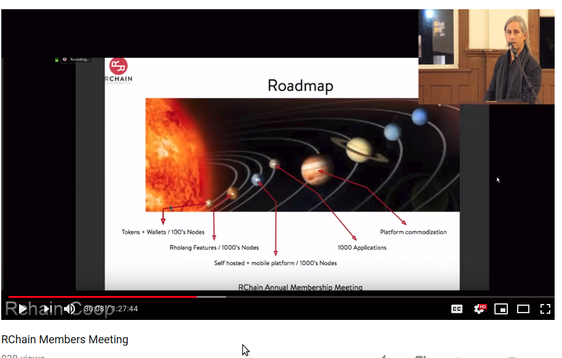

# Roadmap

## RNode Releases

 - Oct 2018: [RNode v0.7.1: validator bonding, cost accounting, name registry, and Rholang cheat sheet][r071]
   - Get started with RNode v0.7.1 at [developer.rchain.coop](https://developer.rchain.coop).
   - [github release](https://github.com/rchain/rchain/releases/tag/v0.7.1) 1977b93
 - Aug 2018: [RNode v0.6.1 supports launch of the RChain test net][r061]
 - Jul 2018: [RNode v0.5.1 offers all features needed for dApp developers to write and transact smart contracts on the platform][r051]
 - Jun 2018: [RNode v0.4.1 introduces sending Rholang smart contracts across the network][r041]
 - May 2018: [RNode v0.3.1 introduces the RChain consensus protocol][r031]
 - Apr 2018: [RNode-0.2.1 integrates Rholang to the RChain Node][r021]
 - Mar 2018: [RChain node version 0.1.3 released][r013]
 - Dec 2017: [RChain Node.Hello (v0.1) Released][r01]

[r071]: https://medium.com/rchain-cooperative/rnode-v0-7-1-offers-validator-bonding-cost-accounting-a-name-registry-and-a-rholang-cheat-sheet-43afc50d98d8
<!-- er... another blog item on 0.7.1??? https://www.rchain.coop/blog/release-of-rnode-v0-7-1/ -->
[r061]: https://medium.com/rchain-cooperative/rnode-v0-6-1-supports-launch-of-the-rchain-test-net-f6ddcacb4b6
[r051]: https://medium.com/rchain-cooperative/rnode-v0-5-1-82c7841940f5
[r041]: https://medium.com/rchain-cooperative/rnode-v0-4-1-introduces-sending-rholang-smart-contracts-across-the-network-e076d0961b3e
[r031]: https://medium.com/rchain-cooperative/rnode-v0-3-1-introduces-the-rchain-consensus-protocol-23e67666ba82
[r021]: https://medium.com/rchain-cooperative/rnode-0-2-1-integrates-rholang-to-the-rchain-node-183c0e13b024
[r013]: https://medium.com/rchain-cooperative/rchain-node-version-0-1-3-released-ede6cb2d57f7
[r01]: https://medium.com/rchain-cooperative/rchain-node-hello-v0-1-released-98d255a9567d

## The Flight to Mercury

The Mercury release is planned for Q1 2019. [The Flight to
Mercury][ftm] shows large milestones in the project, subject to
change. [Development Team Updates][dtu] are given in each [weekly
community debrief][wcd].

[ftm]: https://rchain.atlassian.net/wiki/spaces/CORE/pages/105709609/The+Flight+to+Mercury
[dtu]: https://rchain.atlassian.net/wiki/spaces/DOC/pages/177045583/Development+Team+Updates
[wcd]: https://www.rchain.coop/blog/category/community-debriefs/

## Mercury, Venus, Earth, and beyond

Greg Meredith outlined these in his [technical
summary](https://youtu.be/CXA_LqsJaks?t=1089) at the Oct 2017 annual
meeting:

 - Mercury: tokens + wallets over 100's of nodes
 - Venus: Rholang Features over 1000's of nodes
 - Earth: Self hosted + mobile platform over 1000's of Nodes

